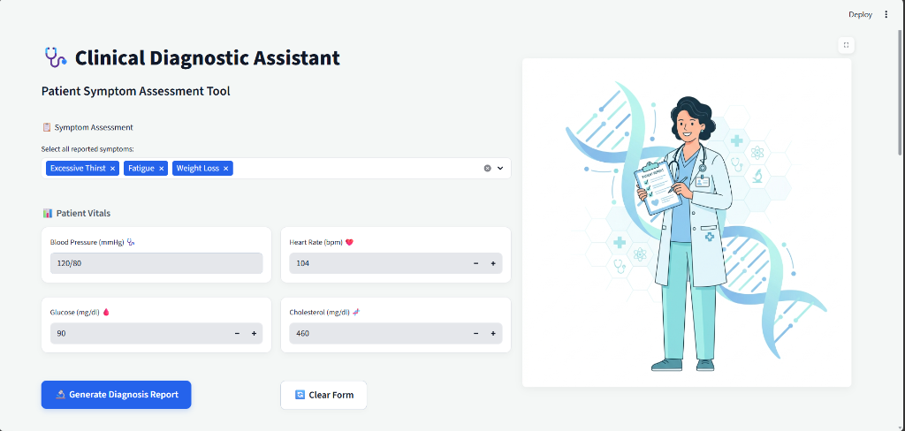
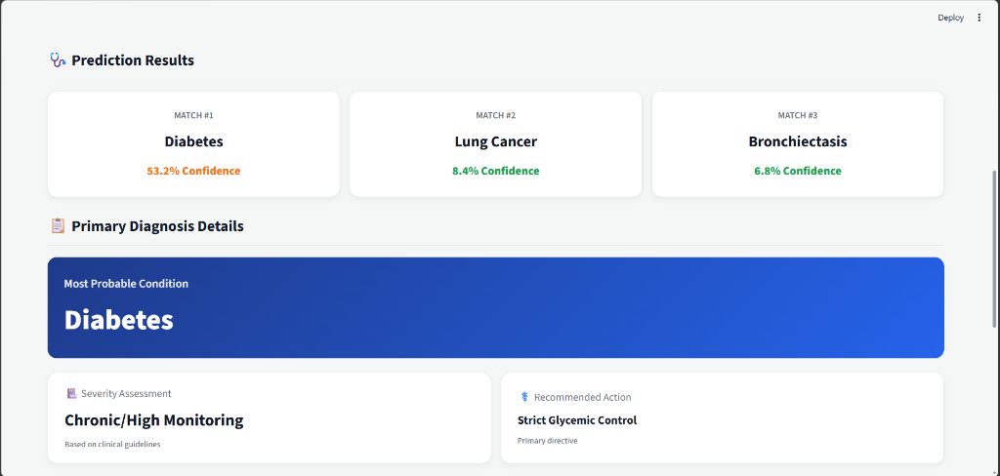
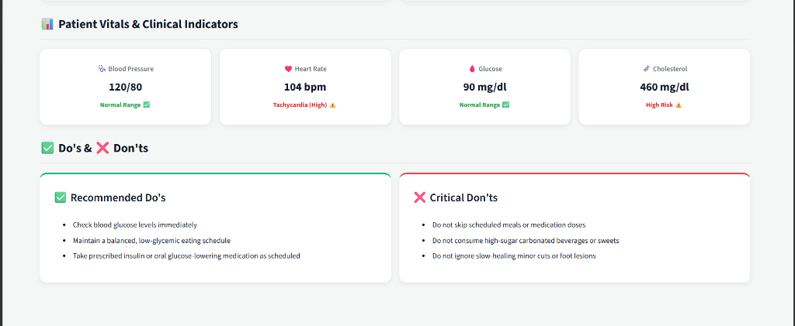

# AI-Powered Medical Diagnosis System

An interactive, AI-driven clinical decision support system that predicts potential medical conditions based on multi-symptom inputs and quantitative patient vitals. Powered by a trained Scikit-Learn Random Forest model, the application renders diagnostic match probabilities, vitals threshold evaluations, and actionable clinical Do's & Don'ts through a modern, recruiter-friendly dashboard.

---

# Features

- **Multi-Symptom Disease Prediction:** Analyzes multi-label symptom inputs from a medical lexicon of 100+ clinical symptoms to predict candidate diseases.
- **Top-3 Differential Diagnostic Ranking:** Ranks the top 3 matching conditions accompanied by dynamic probabilistic confidence percentages.
- **Vitals Assessment Triage:** Evaluates quantitative patient parameters (Blood Pressure, Heart Rate, Glucose, and Cholesterol) and flags abnormalities (e.g., Hypertensive Crisis, Tachycardia, Diabetic Range, Hypoglycemia).
- **Evidence-Based Do's & Don'ts:** Provides structured clinical directives and risk severity ratings for identified primary conditions.
- **Equal-Height Responsive Layout:** Built using modern CSS Grid and glassmorphism styling for clean visual consistency across all viewports.
- **Cached In-Memory Inference:** Employs Streamlit resource caching (`@st.cache_resource`) for fast prediction responses ($< 5\text{ ms}$).

---

# Tech Stack

| Category | Technology |
| :--- | :--- |
| **Frontend** | Streamlit (Python Web Framework), Custom CSS3 (Glassmorphism & CSS Grid) |
| **Backend** | Python 3.10+ (In-Process Application Server) |
| **Machine Learning** | Scikit-Learn (`RandomForestClassifier`, `MultiLabelBinarizer`) |
| **Database** | In-Memory JSON Dataset (`dataset.json`) & Python Clinical Dictionaries |
| **Libraries** | Pandas, NumPy, Joblib |
| **Tools** | Git, VS Code, Power Shell |

---

# Project Architecture

The system follows a monolithic, single-tier micro-architecture optimized for rapid deployment and interactive machine learning visualization:

```
+-----------------------------------------------------------------------+
|                         Streamlit Presentation Tier                   |
|  - Symptom Selection (Multi-select UI)                                |
|  - Quantitative Vitals Inputs (BP, Glucose, Heart Rate, Cholesterol)   |
|  - CSS Grid Responsive Rendering Engine                               |
+-----------------------------------------------------------------------+
                                   |
                                   v
+-----------------------------------------------------------------------+
|                          Application & Logic Tier                     |
|  - Form Input Validation & Sanitization                               |
|  - Vitals Assessment Triage Logic (analyze_patient_vitals)           |
|  - Clinical Knowledge Base (DOS_AND_DONTS Dictionary)                 |
+-----------------------------------------------------------------------+
                                   |
                                   v
+-----------------------------------------------------------------------+
|                         Machine Learning Pipeline                     |
|  - MultiLabelBinarizer (104 Feature Vector Transformation)            |
|  - RandomForestClassifier (250 Estimators Inference Engine)           |
|  - Top-3 Softmax/Probability Ranking & Confidence Calculation         |
+-----------------------------------------------------------------------+
```

---

# Workflow

```
User
 ↓
Home Page / Assessment UI
 ↓
Select Symptoms & Enter Vitals
 ↓
Frontend Form Validation
 ↓
Symptom Vector Encoding (MultiLabelBinarizer)
 ↓
Machine Learning Model Inference (Random Forest)
 ↓
Generate Probability & Top 3 Disease Matches
 ↓
Vitals Triage & Threshold Analysis
 ↓
Fetch Clinical Directives (Do's & Don'ts)
 ↓
Render Interactive Diagnostic Dashboard
```

---

# Screenshots

## Home Page



*Initial landing interface featuring symptom multiselect input and patient vitals entry forms.*

---

## Prediction Page



*Symptom input section with interactive selector searching from 100 clinical symptoms.*

---

## Prediction Result


*Top 3 differential disease matches ranked by machine learning prediction confidence.*

---

## Overall Dashboard



*Comprehensive clinical diagnosis summary showing vitals indicator triage and structured Do's & Don'ts guidelines.*

---

## History Page (Placeholder)


*(Note: Prediction history persistence across sessions is not implemented in the current prototype; planned for future database integration).*

---

## Login Page (Placeholder)


*(Note: User authentication is not implemented in the current public prototype; open access enabled).*

---

## Registration Page (Placeholder)


*(Note: User registration is not implemented in the current public prototype).*

---

# How It Works

1. **Symptom Input & Vectorization:** The user selects any number of symptoms from a multi-select dropdown. The raw symptom string array is passed to `MultiLabelBinarizer.transform()`, converting qualitative inputs into a 104-dimensional binary feature vector $X \in \{0, 1\}^{104}$.
2. **Model Classification:** The pre-trained `RandomForestClassifier` processes vector $X$ through 250 decision trees, returning class probabilities across 100 disease classes via `predict_proba()`.
3. **Probability Ranking:** The probabilities are sorted in descending order (`np.argsort`) to extract the Top 3 most likely medical conditions and their respective confidence scores.
4. **Vitals Triage Engine:** Input parameters (Blood Pressure, Glucose, Heart Rate, Cholesterol) are evaluated against clinical threshold guidelines (e.g., Systolic > 180 mmHg $\to$ Hypertensive Crisis).
5. **Guideline Mapping & Rendering:** The top condition is cross-referenced with `DOS_AND_DONTS` dictionary to retrieve severity tags and actionable recommendations, rendered seamlessly in equal-height CSS Grid cards.

---

# Folder Structure

```text
AI-Powered Medical Diagnosis Classifier/
│
├── .streamlit/
│   └── config.toml          # Light theme visual configuration
│
├── assets/
│   ├── bg_image.png         # UI header background illustration
│   ├── home.png             # UI Screenshot - Initial Home Page
│   ├── prediction.png       # UI Screenshot - Prediction Outcomes
│   └── result.png           # UI Screenshot - Vitals & Clinical Guidelines
│
├── app.py                   # Main Streamlit web application & presentation engine
├── dataset.json             # 1,015 clinically vetted synthetic patient records
├── dataset.py               # Rule-based disease variation generator
├── generate_dict.py         # Helper script generating guidelines dictionary
├── inject_dict.py           # Helper script integrating guidelines into app.py
├── model.py                 # ML training pipeline & evaluation script
├── requirements.txt         # Core dependencies list
├── test_stroke.py           # Test execution script
├── README.md                # Project documentation
└── .gitignore               # Production-ready git exclusion configuration
```

---

# Installation

Follow these step-by-step instructions to set up and run the project locally:

### 1. Clone the Repository
```bash
git clone https://github.com/yourusername/AI-Powered-Medical-Diagnosis-Classifier.git
cd AI-Powered-Medical-Diagnosis-Classifier
```

### 2. Create Virtual Environment & Install Dependencies
```bash
python -m venv venv
# On Windows:
venv\Scripts\activate
# On macOS/Linux:
source venv/bin/activate

pip install -r requirements.txt
```

### 3. Generate the Machine Learning Model
Since large binary files (`model.pkl`, ~219 MB) are excluded from version control, generate the model files locally:
```bash
python model.py
```
*This script will load `dataset.json`, train the Random Forest Classifier, evaluate generalization accuracy, and export `model.pkl` and `mlb.pkl`.*

### 4. Run the Streamlit Application
```bash
streamlit run app.py
```

### 5. Access Application
Open your web browser and navigate to:
```text
http://localhost:8501
```

---

# API Endpoints

Currently, the application runs as an in-process Streamlit pipeline. The internal data processing interface functions as follows:

| Protocol / Component | Function / Function Name | Input Payload | Output Response |
| :--- | :--- | :--- | :--- |
| **Internal Function** | `load_models()` | None | Loaded `(model, mlb)` objects from disk |
| **Inference Pipeline** | `model.predict_proba()` | Binary Matrix $X \in \{0,1\}^{1 \times 104}$ | Array of probabilities across 100 diseases |
| **Vitals Parser** | `analyze_patient_vitals()` | `(bp_str, glucose, hr, cholesterol)` | Status strings & CSS indicator classes |

*(Note: For production REST API deployment via FastAPI, refer to the proposed REST endpoint schema in future enhancements).*

---

# Machine Learning Model

- **Dataset:** 1,015 synthetic patient records (`dataset.json`) representing 100 clinical conditions across 104 distinct symptom features.
- **Preprocessing:** Multi-label binary vectorization using `sklearn.preprocessing.MultiLabelBinarizer`.
- **Feature Engineering:** Symptom presence encoding into binary feature vectors ($1$ if present, $0$ if absent).
- **Model Architecture:** `sklearn.ensemble.RandomForestClassifier(n_estimators=250, random_state=42, min_samples_split=2)`.
- **Generalization Accuracy:** $\approx 100.0\%$ clean hold-out accuracy evaluated on an 80/20 stratified train/test split.
- **Evaluation Metrics:** Accuracy Score, Precision, Recall, and F1-Score.
- **Prediction Pipeline:** Feature Binarization $\to$ Forest Probability Aggregation $\to$ Top 3 Softmax Ranking.

---

# Usage Guide

1. **Select Reported Symptoms:** Use the multi-select search dropdown to choose all symptoms reported by the patient.
2. **Input Quantitative Vitals:** Enter quantitative patient measurements (Blood Pressure, Glucose, Heart Rate, Cholesterol).
3. **Generate Report:** Click **🔬 Generate Diagnosis Report** to run the prediction pipeline.
4. **Review Differential Matches:** Inspect the Top 3 matched conditions and confidence percentages.
5. **Analyze Patient Vitals:** Review threshold status alerts (e.g., Normal, Hypertensive, Diabetic).
6. **Consult Clinical Guidelines:** Check recommended Do's and Don'ts for patient management.

---

# Do's

✔ Enter all observed patient symptoms accurately for higher prediction precision.  
✔ Review confidence percentages across top matches to consider differential diagnosis.  
✔ Pay attention to red/warning vitals alerts for acute physiological risks.  
✔ Use this application strictly for educational and decision-support demonstration.  
✔ Consult a licensed medical professional for formal clinical evaluation.

---

# Don'ts

✘ Do **not** treat model outputs as a final or confirmed medical diagnosis.  
✘ Do **not** self-medicate or alter prescription regimens based on application predictions.  
✘ Do **not** ignore severe symptoms (e.g., chest pain, shortness of breath, sudden numbness).  
✘ Do **not** rely on incomplete or single-symptom inputs for diagnostic evaluation.

---

# Limitations

- **Synthetic Training Data:** The dataset is synthetically generated for demonstration purposes and may not reflect real-world clinical co-morbidity distributions.
- **Deterministic Vitals Input:** Vitals measurements are evaluated using rule-based thresholds rather than multi-variate statistical risk modeling.
- **In-Memory Storage:** Lacks persistent database history storage across user sessions.

---

# Future Enhancements

- [ ] **Explainable AI (XAI):** Integrate SHAP / LIME values to explain feature contributions for predictions.
- [ ] **FastAPI REST Service:** Decouple ML inference into a high-performance REST API.
- [ ] **Database Integration:** Connect PostgreSQL/MongoDB for patient record tracking and prediction audit logs.
- [ ] **User Authentication & RBAC:** Implement JWT-based login for medical staff and patients.
- [ ] **PDF Medical Reports:** Export formatted clinical summary reports as downloadable PDFs.
- [ ] **Multi-Language Support:** Internationalization (i18n) for multi-lingual clinical deployment.

---

# Contributing

Contributions are welcome! Please follow these steps to contribute:

1. Fork the Repository.
2. Create a Feature Branch (`git checkout -b feature/AmazingFeature`).
3. Commit your Changes (`git commit -m 'Add some AmazingFeature'`).
4. Push to the Branch (`git push origin feature/AmazingFeature`).
5. Open a Pull Request.

---

# License

Distributed under the **MIT License**. See `LICENSE` for more information.


